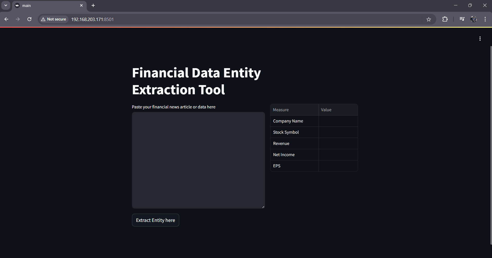

# financial_data_extraction_using_LLM

*The **Financial Data Extraction** tool is a streamlit based app that uses openai api to extract key financial measures such as company name, stock symbol, revenue, net income etc. from a news article. The news article is typically an article about company's finance reporting.* 

## Features 
* **PDF Upload:** Users can upload a PDF file to the app. 
* **Interactive Chat:** Once the PDF is uploaded, users can chat with the app to extract relevant information, get summaries, or ask specific questions. 
* **Text Extraction:** The app reads the content of the PDF and makes it searchable. 
* **Contextual Responses:** The chatbot provides responses based on the content of the uploaded PDF. 

## Technologies Used 
* **Frontend:** Streamlit 
* **Backend:** Python 
* **NLP:** OpenAI API or similar language models for text-based interaction. 
* **Real-time Processing:** Instantaneous interaction with the document content. 
* **PDF Processing:** PyPDFLoader and other Python libraries for text extraxtion. 
* **File Storage:** Chroma storage for PDFs. 

## Getting Started
### Prerequisites
* Python 3.11+ 
* Gradio (for frontend) 
* Dependencies (listed below) 

### Installation
1. Clone the repositery: 
git clone https://github.com/vishwajeetsingh01/finanatial_data_extraction_using_LLM.git 
cd finanatial_data_extraction_using_LLM

2. Create a virtual environment in the terminal: 
python -m venv venv

3. Activate virtual environment: 
.\venv\Scripts\activate

**Note:** *If you get error than fire the below commond: Set-ExecutionPolicy -Scope Process -ExecutionPolicy Bypass*

4. Install dependencies: 
pip install -r requirements.txt

**Note:** You need to create an account on openai website. You will get inital 5$ free credits which is more than enough for this project. Once you get an api key from your account add it to .env file.

5. Run the application: 
python main.py

Now, the app should be running on locally at http://127.0.0.1:7860/.

## File Upload
To interact with the PDF, simply click on the Upload PDF button on the frontend, select a file, and the chat interface will be ready to respond based on the content of the document.

## Usage
**Chat with PDF:** After uploading a PDF, ask questions related to its contents (e.g., "What is the summary of this document?", "Tell me about the second chapter."). 
**Extract Information:** You can ask for specific data or quotes directly (e.g., "What is the value of X in section 3?"). 
**Summarization:** Ask the bot to provide a concise summary of the entire document or specific sections. 

## Contributing
Contributions are welcome! If you find any issues or would like to add new features, please open an issue or submit a pull request.

1. Fork the repository
2. Create your feature branch (git checkout -b feature/your-feature)
3. Commit your changes (git commit -am 'Add new feature')
4. Push to the branch (git push origin feature/your-feature)
5. Open a pull request

## Achnowledgements
* Special thanks to OpenAI API for providing powerful language models. 
* Thanks to the maintainers of PyPDFLoader for their contributions to PDF processing. 
* Inspired by modern AI-driven tools for document analysis and interaction.

  
